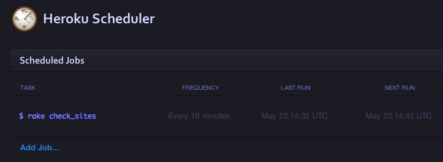

## Development

Start application with:

    $ bundle
    $ createdb yourappname
    $ shotgun app.rb
    
Or if using Foreman, .env, and a Procfile
    
    $ foreman start

To access and change data via the console

    $ irb
    $ require './app.rb'
    $ Site.all.first
    
## Twilio Setup

1. Get a Twilio SMS account and add your phone number and keys to your .env file
2. Add your Twilio keys to Heroku config

````
$ heroku config:add MY_TWILIO_NUM=5558675309 TWILIO_ACCOUNT_SID=XXXXXXXXXSIDXXXXXXXX TWILIO_ACCOUNT_TOKEN=XXXXXXXXTOKENXXXXXXXX
````
    
## Heroku Scheduler

In order to check to see if a site is "UP" or "DOWN" you will need to setup a scheduled rake task using Heroku's Scheduler

    $ heroku addons:add scheduler:standard
    $ heroku addons:open scheduler
    
Create a Job that runs "rake check\_sites"    

  
  
## Datamapper Basics

**Create**

    $ Site.create(url: "http://laternote.com")

**Find**

    $ Site.get(1)
    $ Site.first(:url => "http://laternote.com")

**Destroy**

    $ site = Site.get(5)
    $ site.destroy  # => true

####[Datamapper Documentation](http://datamapper.org/docs/)